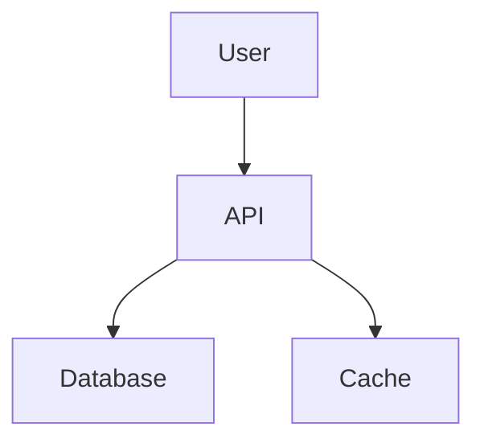
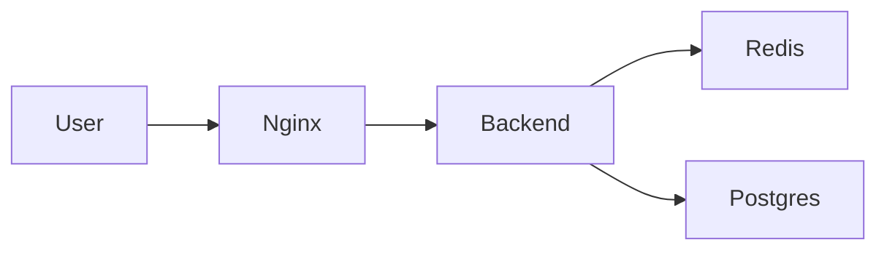
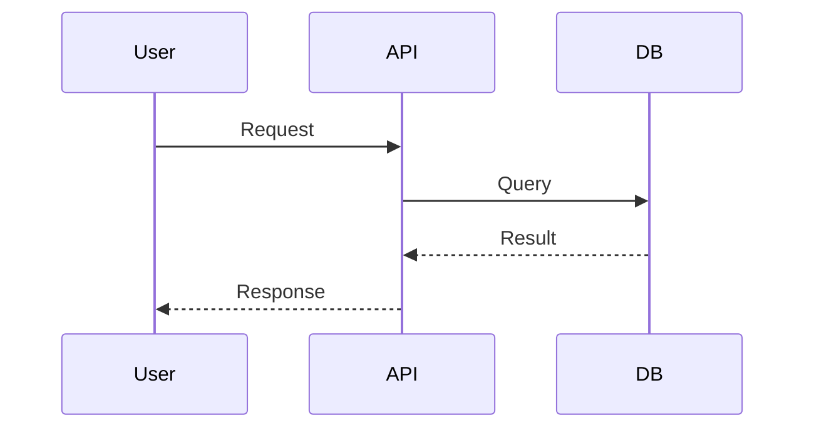
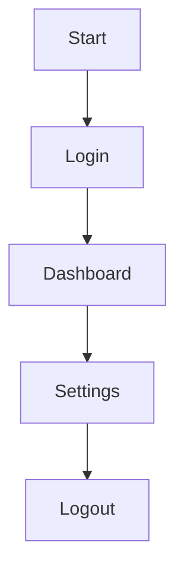
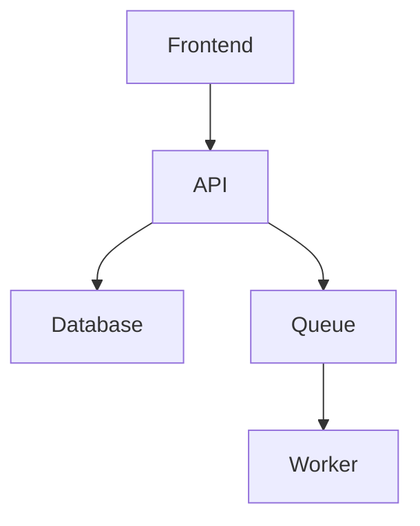
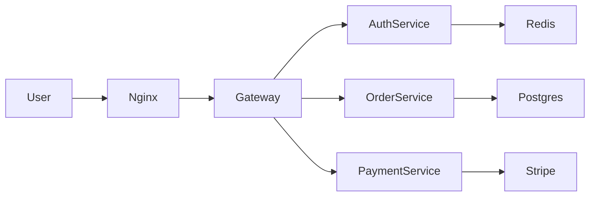
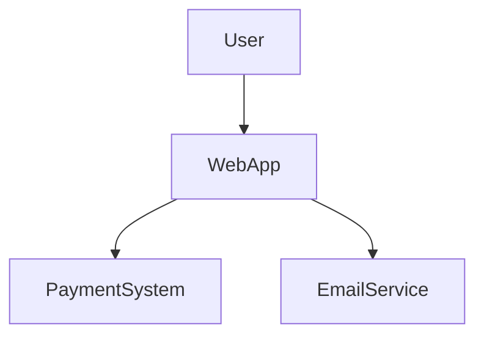
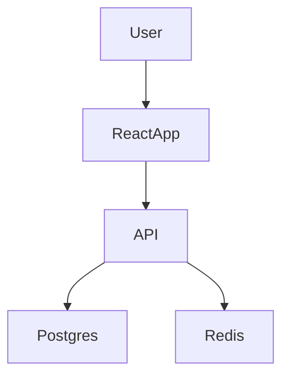
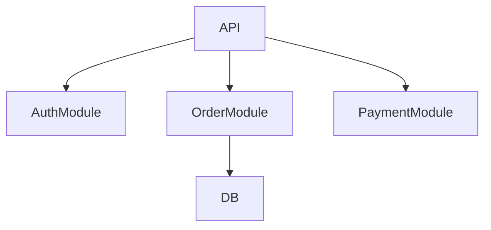
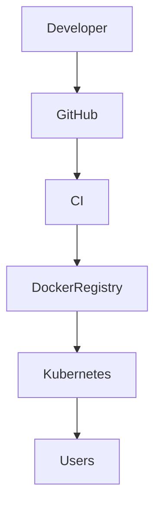

## Установка Sphinx на Linux Mint через Docker

* * *
### 1. Создаем папку проекта

```bash
mkdir sphinx-docs
cd sphinx-docs
```

* * *
### 2. Dockerfile для Sphinx

Создаём файл:

```bash
nano Dockerfile
```

Содержимое:

```text
FROM python:3.12-slim

COPY requirements.txt .
RUN pip install --no-cache-dir -r requirements.txt

WORKDIR /docs
```

* * *
### 3. Mинимальный requirements.txt:

```text
sphinx
sphinx-rtd-theme
myst-parser
sphinx-autobuild
sphinx-copybutton
sphinx-design
sphinxcontrib-mermaid
```

#### после установки полезно обновить:

```bash
pip freeze > requirements.txt
```

* * *
### 4. docker-compose.yml

```bash
nano docker-compose.yml
```

```yaml
services:
  sphinx:
    build: .
    volumes:
      - .:/docs
    ports:
      - "8000:8000"
    command: sphinx-autobuild source build/html --host 0.0.0.0 --port 8000
    working_dir: /docs
```

* * *
### 5. настройка файла conf.py

```python
extensions = [
    "myst_parser",
    "sphinx.ext.mathjax",
    "sphinx_autobuild",
    "sphinx_copybutton",
    "sphinx_design",
    "sphinxcontrib.mermaid",
]

templates_path = ['_templates']
exclude_patterns = []

html_theme = "sphinx_rtd_theme"

source_suffix = {
    ".rst": "restructuredtext",
    ".md": "markdown",
}

html_static_path = ['_static']
```

* * *
### 6. Инициализация проекта Sphinx

Запускаем контейнер:

```bash
docker compose run --rm sphinx sphinx-quickstart
```

Рекомендуемые ответы:

```text
Separate source and build directories: y
Project name: MyDocs
Author name: Your Name
Project version: 1.0
```

После этого появится структура:

```text
sphinx-docs/
 ├── build
 ├── source
 │   ├── conf.py
 │   ├── index.rst
 │   └── _static
 ├── Dockerfile
 └── docker-compose.yml
```

* * *
### 7. Запуск контейнера и автосборка:

```bash
docker compose up
```

После этого документация будет доступна в браузере:

```text
http://localhost:8000
```

### Итог
- изолированный Sphinx
- нет Python зависимостей в системе
- воспроизводимая сборка через Docker

* * *
## Как включить автогенерацию API

### 1. Добавить расширения и путь к коду в `conf.py`:

```python
extensions = [
    "myst_parser",
    "sphinx.ext.autodoc",
    "sphinx.ext.napoleon"
]
```

```python
import os
import sys
sys.path.insert(0, os.path.abspath(".."))
```

### 2. Создать страницу API:

Например:

```text
source/api.rst
```

```rst
API Reference
=============

.. automodule:: myproject.math
   :members:
   :undoc-members:
   :show-inheritance:
```

### 3. Автоматическая генерация всех модулей:

```bash
sphinx-apidoc -o source/api ../myproject
```

- source/api - папка с документацией
- myproject - код

* * *
#### Что генерируется автоматически

- модули
- классы
- функции
- методы
- атрибуты
- исключения
<br>
#### Система используется в огромных проектах:

- FastAPI
- NumPy
- Kubernetes
- TensorFlow
<br>
#### Плюсы:

- документация всегда актуальна
- не нужно писать её отдельно
- легко поддерживать
- отлично работает с CI/CD

* * *
## Диаграммы Mermaid

#### В .md файле:



#### Пример диаграммы архитектуры



Подходит для:

- архитектуры системы
- микросервисов
- CI/CD
- сетей
- потоков данных

#### Sequence диаграммы



#### Flowchart



#### Mermaid поддерживает:

- Flowcharts
- Sequence diagrams
- Class diagrams
- State diagrams
- Git graphs
- ER diagrams
- Gantt charts

#### Архитектура



**Такая документация:**

✅ выглядит как **docs Kubernetes / GitLab**
✅ диаграммы обновляются вместе с кодом
✅ хранится в Git
✅ можно редактировать как обычный текст

#### Что показывают архитектурные диаграммы

- компоненты системы
- сервисы
- базы данных
- очереди
- API
- пользователей
- взаимодействие между ними

### Более сложный пример (микросервисы)



Это уже показывает:

- gateway
- микросервисы
- базы
- внешние сервисы

* * *

## C4 Model (профессиональный стандарт)

Модель C4 разбивает архитектуру на уровни:

| Уровень | Что показывает |
| --- | --- |
| Context | систему целиком |
| Container | сервисы |
| Component | модули |
| Code | классы |

### 1. Context diagram



Показывает **внешние системы**.

### 2. Container diagram



Показывает **основные сервисы**.

### 3. Component diagram



Показывает **внутреннюю структуру сервиса**.

#### Где такие диаграммы используют
Практически во всех крупных проектах:

- Kubernetes
- GitLab
- FastAPI
- Apache Kafka

#### Пример DevOps архитектуры



Это показывает **pipeline доставки приложения**.

#### Почему это полезно
Архитектурные диаграммы:

✅ быстро объясняют систему
✅ помогают новым разработчикам
✅ показывают зависимости
✅ документируют инфраструктуру

* * *
## Полезные значки
🚀 Быстрый старт
📦 Установка
⚙️ Конфигурация
🐳 Docker запуск

ℹ️ NOTE
⚠️ WARNING
💡 TIP
❗ Important
🔥 Danger

🐳 Docker
🐍 Python
☸️ Kubernetes
🗄️ PostgreSQL
⚡ Redis

✅ поддерживается
❌ не поддерживается
⚠️ экспериментально
🚧 в разработке

### Примеры использования

ℹ️ Note (заметка)

Используют для:

- дополнительной информации
- уточнений
- комментариев

⚠️ Warning (предупреждение)

Используется когда:

- можно сломать систему
- есть риск потери данных
- есть ограничения

💡 Tip (совет)

Подходит для:

- полезных лайфхаков
- ускорения работы

❗ Important

Используется **для критически важной информации**.

🔥 Danger

Используют для:

- опасных операций
- destructive commands

